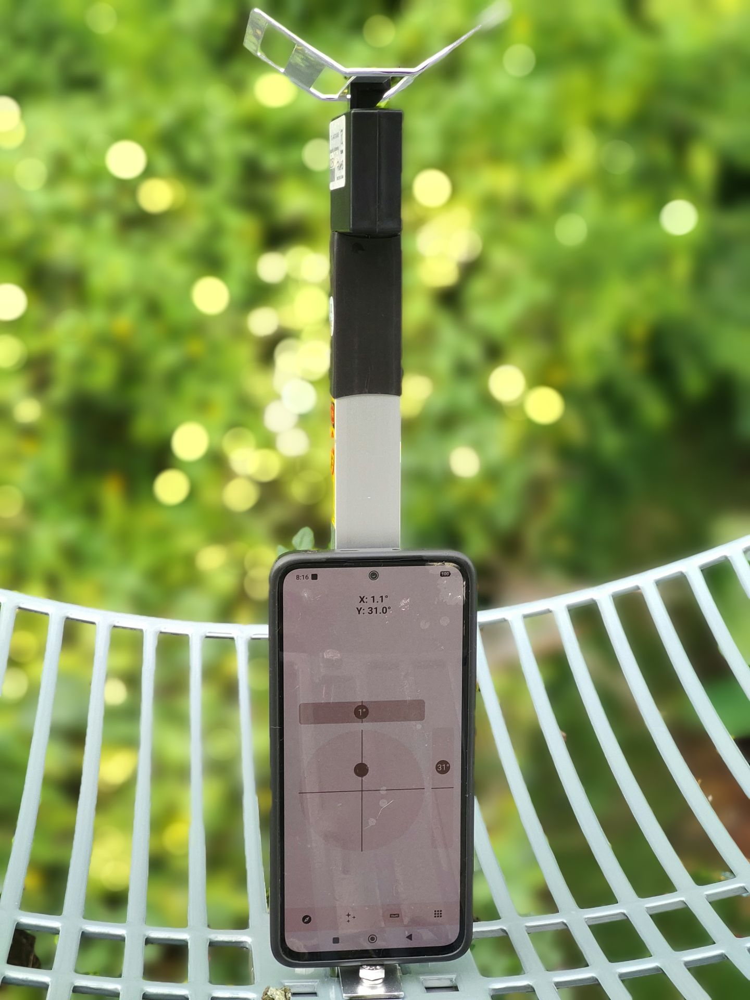
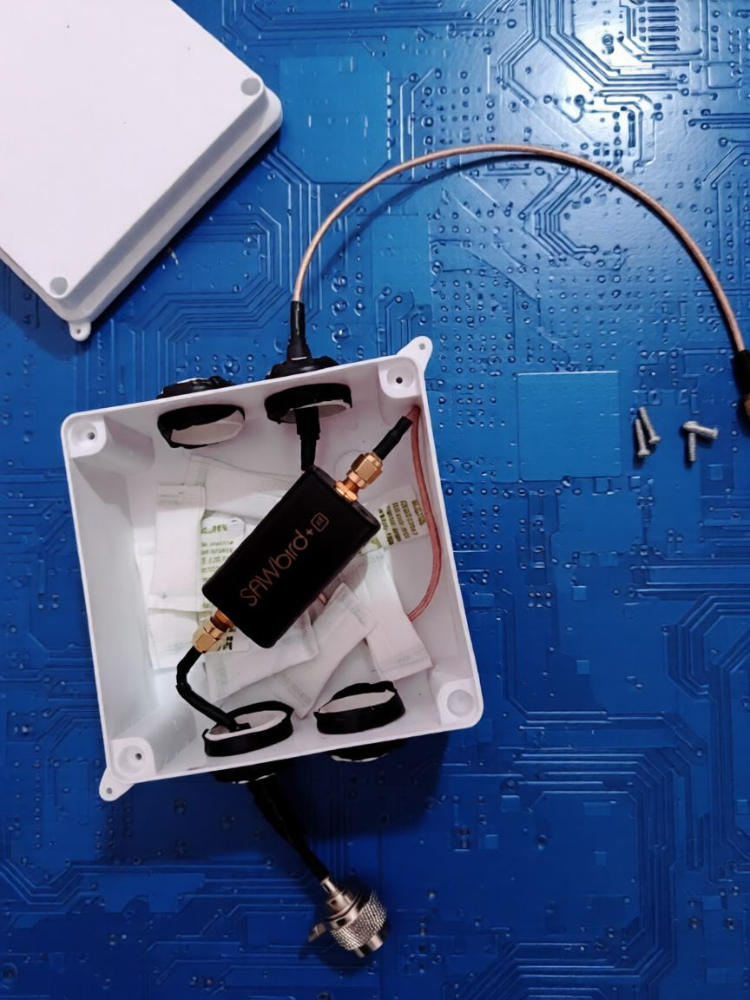
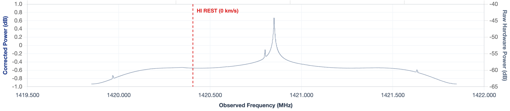

# Live radio telescope observatory for the 21 cm Hydrogen line

The radio telescope observatory is hosted on GitHub at https://bkb3.github.io/hydrogen-observatory/.

People have been using SDR to observe the 21 cm Neutral Hydrogen Line [1420.4058 MHz](https://en.wikipedia.org/wiki/Hydrogen_line) for a while now. Many of them do it for a couple of days and vanish. Others do a long term but their data isn't generally public. Many of them also use a GUI based software which is fine but that's a problem if you're doing long term observations on a headless SBC.

The goal of this repo is to address those issues. In particular, I plan to update the long term daily measurements of  spectrum from my radio telescope. The data will be updated automatically at around UTC 00:00:00 so it isn't exactly live though. The automated system should work fine most of the time if it isn't failing silently. If sometimes you see `File 'XXXX/XX/XX hydrogen.dat.gz' not found` popup, please select an earlier date as there will be a delay of 1 day. If you don't see recent data for longer periods, please let me know.

## Setup
My radio telescope is a standard 2.4 GHz grid antenna, with the Reflector feed flipped/modified for 1.42 GHz. I used [SAWbird+ H1 LNA](https://www.nooelec.com/store/sawbird-h1.html) and [SMArTee XTR](https://www.nooelec.com/store/nesdr-smartee-xtr-sdr.html), both from NooElec. I did some basic waterproofing on the LNA, not sure how long will it hold lol. Until then, all the data gathered will be available here for your pleasure!

| Antenna | LNA |
| :---: | :---: |
|  |  |

The observatory uses a transit-mount setup relying on Earth's rotation to sweep across Galactic longitudes throughout the day. The antenna points at azimuth 180° (South) with elevation of 30° and is located at latitude 27.68° N. 

### Offset tuning
Due to the inherent central DC spike in SDR and anti-aliasing filter attenuation at the band edges, only a narrow passband (approximately 400 kHz) remains flat and usable towards either side of the spike. Offset tuning shifts the local oscillator away from the rest frequency, placing the 21 cm HI line squarely in the middle of this flat, well-behaved region. This prevents baseline distortion and makes it easier for baseline fitting and removal. This offset frequency is read form the logs and displayed.

I used [rtl_power_fftw](https://github.com/AD-Vega/rtl-power-fftw) to read data from the SDR with an integration time of 10 mins. The [shell script](radio_telescope.sh) and the [commands](commands.txt) to run it locally are in this repo if you want to use it.  

LLM (particulary Gemini) was used generously to write parts of the code as I am not spending days centering div lmao. 

